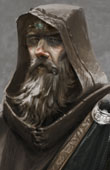

<h1></a>Saradas Magic for BG2 (WIP)</h1>

<h3>A Spellhold Studios mod for Baldur's Gate II:ToB, Baldur's Gate Trilogy, BG2:EE and EET<h3>

## 

 

**Author:** <a href="">Saradas</a>  
**Mod Website:** <a href="">Spellhold Studios</a>  
**Mod Forum:** <a href="">TODO</a>

## 

## 

<a href="#intro">Overview</a> &#8226; <a href="#compat">Compatibility</a> &#8226; <a href="#installation">Installation</a> &#8226; <a href="#details">Details</a> &#8226; <a href="#components">Components</a> <a href="#credits">Credits and Acknowledgements</a> &#8226; <a href="#versions">Version History</a> 

## Overview

 This mod introduces a new NPC, Saradas the archmage, which interacts in various ways with the Bhaalspawn's group. In Shadows of Amn, he is a non-playable NPC that offers many services to the Bhaalspawn's group. You can find him in the temple of Lathander, in the Temple District of Athkatla. In addition to having several exclusive dialogues that take place as the plot takes shape, his store is worth the visit.

SARADAS MAGIC 2:SoA PART

In addition to having several exclusive dialogues that take place as the plot takes shape, he offers:
- Identification at reduced price
- Cure the party when one or more members of the group are seriously injured
- An advanced artificial intelligence scripted by Saradas that offers an epic fight, should you decide to fight him
- A store with exclusive articles

In the latter, you can find seven brand new arcane spells I created:
- Flawless Teleport
- Lashing Wind
- Gravitational Field
- Horrid transformation
- Drain Spell
- Spectacular Combustion
- Tenser's Supremacy

The prices are not very cheap, but you can still try to steal from the store. :wink:

In addition, Saradas is an artifacts collector. If you find any ancient artifact, you can bring it to him, and he will enchant it for you, granting magic properties to the item. I have introduced this new feature in Saradas Magic 2 because sometimes, after a quest has been completed, it's not rare to find some useless items inside your inventory. The funny thing is they are mostly ancient relics made of gold but end up being sold for a fistful of coins or abandoned in some dusty chest, and forgotten soon after. My idea was to give them a purpose. The six artifacts are:
- The Shaman's Staff
- The Book of Kaza
- The Mask of King Strohm III
- The Shadow Dragon Wardstone
- The Symbol of Amaunator
- The Mantle of Waukeen

Saradas Magic 2 aims to improve the tactical approach to the game as a magician, in the battles of the Forgotten Realms, creating dozens of new devastating combinations. This is possible with the new exclusive class skills. You certainly felt that one increased slot capacity for spell level was not a very high reward for being a specialist mage. So, I introduced those epic level spells that can be acquired after you finish the Underdark portion of the game. Saradas will teach you the skill related to your mage class. All this is possible thanks to the epic level spells, available for each school of specialization, and taught by Saradas:
- Spiritual Explosion (Invocation)
- Impenetrable Defense (Abjuration)
- Ego's Frailty (Alteration)
- Summon Devil of Baator (Evocation)
- Foreseeing the future (Divination)
- Absolute abnegation (Enchantment)
- Legion of shadows (Illusion)
- Deathly Hallows (Necromancy)
- Knowledge of the Scholar (Generalist)
- Shroud of wild magic (Wild magic)
- Dragonborn (Dragon Disciple)

(work on pure mages, multi-classed mages, dual-classed mages)

In Throne of Bhaal Saradas is finally a recruitable NPC! You can summon him through the Fate Spirit in your pocket plane. He is a human Priest of Lathander dual-classed to Mage. 

Saradas is an old mage who has spent his entire life traveling throughout Faerûn. His homeland is Sembia, where he has a old house in the city of Yhaunn. He was a priest of Lathander with an innate interest for all the forms of magic. So he started getting more and more interested in studying the arcane arts and ancient artifacts and dedicated his life to this purpose. Before he met the Gorion's ward, he thought that his days as an adventurer were finished, but his interest towards the child of Bhaal grew stronger, and he decided to follow his/her path.

Saradas is a very wise man indeed and he always tries to share his knowledge with the young ones, in his own cryptic way. He doesn't speak much about his past and his trust is hardly earned, but he can be a very good friend to those who prove worthy of his time. You suspect that he's hiding much more information about his past, but you can try and ask him.

In a conversation with Imoen, she will eventually find out that Saradas is more than he shows... 

DEPRECATED as of v 6.0.0

 
<strong>Important:</strong> Download all content you may require from the Infinity Animations download category at <a href="http://www.shsforums.net/files/category/98-infinity-animations/">Spellhold Studios</a>. If in doubt, download them all (most mega-mod installs will need all archives). Extract all archives using the "<em>Do not extract paths</em>" option on the <strong>Advanced</strong> tab in WinRAR. Also, make sure the "Destination path" on the <strong>General</strong> tab terminates in <strong>/content</strong> or <strong>/restore</strong> after <strong>infinityanimations</strong> (there should be no sub-folders beyond that).

Extract all archives to the :file_folder: /content folder except IA_BG2_Restores.rar, which should go in the :file_folder: /restore folder. If you extract IA_Wh_Dr_Wyv_LoP.rar (currently only needed for the Planar Sphere mod), you can delete the sub-archive The_Lady's_Shadow.rar after extraction, as it is currently unused due to animation size limitations.

For WinZip, make sure the "Use folder names" box is *unselected*.

You should end up with a bunch of .bam files and no sub-folders in your :file_folder: "content" and/or "restore" folders. The installer will warn you if you're missing anything you need, at which point you can exit it, download missing content, extract it and rerun the installer.

In his youth, he used to cooperate with a renowned organization that Jaheira knows very well and that seeks to maintain balance in Faerûn.

Between all the companion of the Bhaalspawn, Saradas will start a good friendship with one in particular, a venerable paladin of Torm.

Below is a short conversation between the two of them:

DEPRECATED as of v 6.0.0

 

Moreover, Saradas will speak often with the Bhaalspawn to interrogate him/her on his future decisions. The wizard doesn't plan to interfere in his/her destiny, but will try to make him/her ponder on the power he/she controls, to guide him/her to a wise decision.

Obviously, Saradas will not take part in evil deeds because of his good nature, and will leave the party if that is the case. 

Saradas Magic 2 features in Throne of Bhaal :
- Banters and dialogues with many of the original BioWare NPCs
- He expresses his thoughts regarding events and dialogues (interjections)
- He has a custom ring
- You can experience 6 different epilogues
- 1 custom skill
- Dialogues with the protagonist
- Two small but enjoyable easter egg cutscenes. One takes place inside the Sendai's enclave if you have Saradas in your party. The other one eventually triggers if you have both Saradas and Edwin in your party. This time Edwin has really gone too far. :wink:

<a href="#top">Back to top</a>

## Compatibility

<a href="#top">Back to top</a>

## Installation

<a href="#top">Back to top</a>

## Details

<a href="#top">Back to top</a>

## Components

The installer includes the following components. All optional components require the main component to be installed.

<a href="#top">Back to top</a>

## Credits and Acknowledgements

<a href="#top">Back to top</a>

## Version History

##### Version 2.0 &nbsp;(July, 2021)

&#9755; <ins>Major updates</ins>
- Added *saradas_magic_2.ini* metadata file (including dynamic install order syntax and global `LABELS`) to support AL|EN's "Project Infinity".
- Replaced `AUTHOR` keyword with `SUPPORT`.
- Added `VERSION` and `README` keywords.
- Added `REQUIRE_PREDICATE` condition to avoid installing the mod in inaccurate games.
- Externalized tp2 code into *main_component.tpa* library for more comfortable readability and maintenance.
- Commented code as much as possible.
- Added native EET compatibility (thanks Austin!):
    - Added WeiDU's built-in `HANDLE_CHARSETS` function to convert string entries for EE games.
- Added native classic BG2:ToB compatibility (thanks Austin and Gwendolyne!):
    - Restored items usability restriction flags in description for classic games and automatically removed them for EE games with `GW_UPDATE_ITM_DESCRIPTION_TO_EE` WeiDU function.
    - Provided NPC portraits for original games.
- Proofread strrefs (Gwendolyne).
- Fully TRAified the mod (some lines were not traified in .d and tp2 file).
- Added a brand new *saradas_magic_2-readme-english.html* file.
- Lower cased files.
- Reorganized mod architecture tree: created folders to sort files according to their types.
- Included Linux and Mac OS versions in the same package (thanks AL|EN's Infinity Auto Packager tool!).
- Added archive libiconv-1.9.2-1-src.7z with iconv licence info.
- Updated WeiDU installer to v247.
- Uploaded mod to official Spellhold Studios GitHub mirror account.

&#9755; <ins>a. Items and spells updates</ins>
- Fixed classes and kits restriction flags and appended tooltip.2da whenever relevant.
- Added 1PP compatibility to harmonize colors item with EE games and classical 1PP modded games.
- Added *Break Sanctuary* flag whenever relevant for EE games.
- Added Detectable Spells variables whenever relevant.

## 

    !stun.eff (added)

## 

 CHANGELOG: v_1.8

- Added EET-compatibility:
 added adaptation of «chapter» variables in TP2 in case of installation on EET
 added the EET_TRANSITION function
- Added iconv-transcoder for installation on different versions of the game with different languages (in case of future translation), the LAF HANDLE_CHARSETS function was added to TP2 to launch it
- The «COPY ~saradas_magic_2\eff\!Stun.eff~ ~override~» command has been added to the TP2 file, which allows you to add the !Stun.eff file to the game, which was added in version 1.7
- Added an option to set an alternate appearance for Saradas (as a mage, not a monk). Added due to the fact that the monk does not have a paperdoll on the inventory screen and some players asked to add this option
- Added full compatibility with "vanilla" (non-EE) version of the game: 
    - Added adaptation of WILDMAGE and DRAGON_DISCIPLE kits, as well as WIZARD_IMPROVED_ALACRITY spell for the vanilla version of the game. Corresponding changes have been made to the TP2-file and the !SARADAS.d and !Scut01.baf files
    - Added a command to TP2 that adds the dir.ids file to the game when a vanilla version of the game is found (since it is absent in it, and the mod will not be installed without it)
    - Added different size options for portraits (for the EE version of the game and for the classic version of the game) 

##### Version Beta 1.7 &nbsp;(January 24, 2016)

- Fixed *Spectacular combustion* spell: replaced SPCOMEX visual effet with FLMSTRK, and 10 additional points of fire damage instead of 5.
- Nerved *Drain spell* spell to 8 the highest spell level the mage can restore.
- Balanced *Lashing Wind* spell's effects. TODO effect #206 icons.
- .
- .
- .
- .

## 

##### Version 1.6 &nbsp;(April 21, 2014)

- Minor fixes.
- New banters between Saradas and Edwin (in ToB) leading to a funny cutscene.

## 

##### Version 1.5 &nbsp;(Unknown)

- The final encounter with Saradas can no longer occur if he was previously killed in Athkatla.
- The final encounter with Saradas in Suldanesselar has been revisited.
- Saradas now gives a Wish scroll in the final encounter, rather than a Limited Wish scroll.
- Fixed some dialogues.

## 

##### Version 1.4 &nbsp;(Unknown)

- Fixed a bug that prevented dual-classed or multi-classed generalist mage to obtain their epic spell.
- Fixed an exploit that allowed the player to obtain multiple rewards from Saradas in Suldanesselar.

## 

##### Version 1.3 &nbsp;(Unknown)

- Some balance improvements to the artifacts.
- Minor fixes.
- Added a new artifact, the *Enchanted Mantle of Waukeen*.

## 

##### Version 1.2 &nbsp;(Unknown)

- Minor balance fixes and artifact color restyling.

## 

##### Version 1.1 &nbsp;(Unknown)

- Helm artifacts can now only be equipped by proper classes.
- Fixed some erroneous strref showing up in custom spells.

## 

##### Version 1 &nbsp;(Unknown)

- Initial release.

<a href="#top">Back to top</a>

