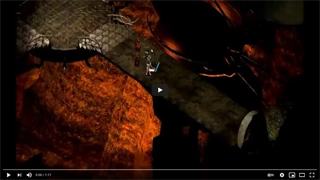

:warning: **The maintenance and support of this project has been moved to a [new repository](https://github.com/Spellhold-Studios/Saradas-Magic-BG2).**

 

<h1></a>Saradas Magic for BG2</h1>

<h3>A Spellhold Studios mod for Baldur's Gate II:ToB, Baldur's Gate Trilogy, BG2:EE and EET<h3>

## 

 

**Author:** <a href="http://www.shsforums.net/user/40868-saradas">Saradas</a>  
**Mod Website and Forum:** <a href="http://www.shsforums.net/forum/633-bgee-modding">Spellhold Studios</a>

## 

 

 

## 

:page_facing_up: [Read the mod's readme](https://spellholdstudios.github.io/readmes/saradas_magic_2-readme-english.html)

:inbox_tray: [Download the mod at Spellhold Studios](http://www.shsforums.net/files/file/1139-saradas-magic-2) 

## 

<a href="#intro">Overview</a> &#8226; <a href="#compat">Compatibility</a> &#8226; <a href="#installation">Installation</a> &#8226; <a href="#details">Details</a> &#8226; <a href="#components">Components</a> <a href="#credits">Credits and Acknowledgements</a> &#8226; <a href="#versions">Version History</a> 

## Overview

This mod introduces a new NPC, Saradas the archmage, who interacts in various ways with the Bhaalspawn's group. In Shadows of Amn, he is a non-playable NPC that offers many services to the Bhaalspawn's group. You can find him in the temple of Lathander, in the Temple District of Athkatla. In addition to having several exclusive dialogues that take place as the plot takes shape, his store is worth the visit.

In addition, Saradas is an artifacts collector. If you find any ancient artifact, you can bring it to him, and he will enchant it for you, granting magic properties to the item.

In Throne of Bhaal Saradas is finally a recruitable NPC! You can summon him through the Fate Spirit in your pocket plane. He is a human Priest of Lathander dual-classed to Mage.

<a href="#top">Back to top</a>

## Compatibility

#### Games supported

This mod is designed to work on the following Infinity Engine games: the original Baldur's Gate II (BG2 or just SoA) with the Throne of Bhaal (ToB) expansion, Baldur's Gate II: Enhanced Edition (BG2EE), the conversion projects <a href="http://www.shsforums.net/forum/261-bgt-weidu/">Baldur's Gate Trilogy (BGT)</a> and <a href="https://github.com/Gibberlings3/EET/releases">Enhanced Edition Trilogy (EET)</a>.

## 

#### Other Mods Compatibility

The Saradas Magic for BG2 mod is a WeiDU mod, and therefore should be compatible with all WeiDU mods. However, we cannot test every single one. It is only compatible with BGII: ToB. If you do encounter an error, please let us know by <a href="http://www.shsforums.net/forum/633-bgee-modding">reporting it on the forum</a>. 

## 

#### Installation Order

>:warning: Since it is required for Saradas Magic for BG2 mod to function properly, classical game players are strongly recommended to download and install the latest version of the <a href="http://www.gibberlings3.net/bg2fixpack/">BG2 Fixpack</a> before proceeding with the installation of this mod. 

Here is the recommended installation order:
- Please install Saradas Magic for BG2 after TobEx, BG2 Fixpack, and EET.
- Please install Saradas Magic for BG2 before EET_End, and any final "biffing" routines.

<a href="#top">Back to top</a>

## Installation

#### Notes

*If you've previously installed the mod, remove it before extracting the new version. To do this, run __`setup-saradas_magic_2.exe`__, un-install the previously installed main component and delete the :file_folder: saradas_magic_2 folder.*

*When installing or un-installing, __do not close the DOS window__ by clicking on the __X__ button! Instead, press the __Enter__ key whenever instructed to do so.*

*__Disable any antivirus__ or other memory-resident software before installing this or any other mod. Some (particularly avast and Norton!) have a tendency to report false positives with mod activity, resulting in failed installs.*

## 

#### Enhanced Editions Note

The Enhanced Editions are actively supported games. Please note that every patch update will wipe your current mod setup! If in the middle of a modded game you might want to delay the patch update (if possible) as even after reinstalling the mods, you might not be able to continue with your old savegames. Alternatively, copy the whole game's folder into a new one that can be modded and will stay untouched by game patches. It is important that you install the mod to the language version you are playing the game in. Otherwise, the dialogues of the mod will not show but give error messages.

## 

#### Windows

Saradas Magic for BG2 for Windows is distributed as an extractable compressed archive and includes a WeiDU installer.

Extract the contents of the mod archive into the folder of the game you wish to modify (*the folder which contains the "CHITIN.KEY" file*), using <a href="http://www.7-zip.org/download.html">7zip</a>, <a href="http://www.rarlab.com/download.htm">WinRAR</a>, or another file compression utility that handles .zip files. On successful extraction, there should be a :file_folder: saradas_magic_2 folder and a setup-saradas_magic_2.exe file in your game folder. To install, simply double-click **`setup-saradas_magic_2.exe`** and follow the instructions on screen.

Run **`setup-saradas_magic_2.exe`** in your game folder to reinstall, un-install or otherwise change the component settings.

## 

#### Mac OS

Saradas Magic for BG2 for Mac OS is distributed in the same compressed archive and includes a WeiDU installer.

First, extract the files from the archive into your game directory. On successful extraction, there should be a :file_folder: saradas_magic_2 folder, setup-saradas_magic_2 and setup-saradas_magic_2.command files in your game folder. To install, simply double-click **`setup-saradas_magic_2.command`** and follow the instructions on screen.

Run **`setup-saradas_magic_2.command`** in your game folder to reinstall, un-install or otherwise change the components settings.

## 

#### Linux

Saradas Magic for BG2 for Linux is distributed in the same compressed archive and does not include a WeiDU installer.

Extract the contents of the mod to the folder of the game you wish to modify.

Download the latest version of WeiDU for Linux from <a href="https://github.com/WeiDUorg/weidu/releases">WeiDU.org</a> and copy weidu and weinstall to `/usr/bin`. Following that, open a terminal, **cd** to your game installation directory, run tolower and answer 'Y' to both queries. You can avoid running the second option (linux.ini) if you've already ran it once in the same directory. To save time, the archive is already tolowered, so there's no need to run the first option (lowercasing file names) either if you've extracted only this mod since the last time you lowercased file names. If you're unsure, running tolower and choosing both options is the safe bet.

To install, run **`weinstall setup-saradas_magic_2`** in your game folder. Then run **`wine bgmain.exe`** (or **`wine baldur.exe`** for EE games) and start playing.

## 

#### Note for Complete Un-installation

In addition to the methods above for removing individual components, you can completely un-install the mod using **`setup-saradas_magic_2 --uninstall`** at the command line to remove all components without wading through prompts. 

<a href="#top">Back to top</a>

## Details

Saradas can be found in the temple of Lathander of Athkatla. In Throne of Bhaal Saradas is finally a recruitable NPC! You can summon him through the Fate Spirit in your pocket plane. He is a human Priest of Lathander dual-classed to Mage.

#### Statistics and Biography

<table cellpadding=0 cellspacing=0 style="margin-top: 1%; margin-left: 80px" summary="Saradas statistics">
	<tr style= "line-height: 170%;">
		<th>Portrait</th>
		<th>Strength</th>
		<th>Dexterity</th>
		<th>Constitution</th>
		<th>Intelligence</th>
		<th>Wisdom</th>
		<th>Charisma</th>
	</tr>
	<tr>
		<td></td>
		<td>
10
</td>
		<td>
13
</td>
		<td>
14
</td>
		<td>
18
</td>
		<td>
20
</td>
		<td>
15
</td>
	</tr>
	<tr>
		<td colspan="7">
		<strong>Biography:</strong>  
		You don't know much about this old wizard, and any attempt to shed some light on the details of his past results in cryptic words. By the way you know that he is over 80 and comes from Sembia. He has been serving as a Priest of Lathander for a good part of his life, until he started studying the arcane magic.</td>
	</tr>
</table>

## 

#### Background

Saradas is an old mage who has spent his entire life traveling throughout Faerûn. His homeland is Sembia, where he has a old house in the city of Yhaunn. He was a priest of Lathander with an innate interest for all the forms of magic. So he started getting more and more interested in studying the arcane arts and ancient artifacts and dedicated his life to this purpose. Before he met the Gorion's ward, he thought that his days as an adventurer were finished, but his interest towards the child of Bhaal grew stronger, and he decided to follow his/her path.

Saradas is a very wise man indeed and he always tries to share his knowledge with the young ones, in his own cryptic way. He doesn't speak much about his past and his trust is hardly earned, but he can be a very good friend to those who prove worthy of his time. You suspect that he's hiding much more information about his past, but you can try and ask him.

## 

#### SoA content

In addition to having several exclusive dialogues that take place as the plot takes shape, Saradas offers:
- Identification at reduced price.
- Cure the party when one or more members of the group are seriously injured.
- An advanced artificial intelligence scripted by Saradas that offers an epic fight, should you decide to fight him.
- A store with exclusive articles.

In the store, you can find seven brand new arcane spells I created:
- Flawless Teleport
- Lashing Wind
- Gravitational Field
- Horrid transformation
- Drain Spell
- Spectacular Combustion
- Tenser's Supremacy

The prices are not very cheap, but you can still try to steal from the store. :wink:

&#9755; For spells descriptions, please read the <a href="https://spellholdstudios.github.io/readmes/saradas_magic_2-readme-english.html#details#spells">mod readme</a>.

&nbsp;

&#10173; In addition, Saradas is an artifact collector. If you find any ancient artifact, you can bring it to him, and he will enchant it for you, granting magic properties to the item. I have introduced this new feature in Saradas Magic 2 because sometimes, after a quest has been completed, it's not rare to find some useless items inside your inventory. The funny thing is they are mostly ancient relics made of gold but end up being sold for a fistful of coins or abandoned in some dusty chest, and forgotten soon after. My idea was to give them a purpose. The six artifacts are:
- The Shaman's Staff
- The Book of Kaza
- The Mask of King Strohm III
- The Shadow Dragon Wardstone
- The Symbol of Amaunator
- The Mantle of Waukeen

&nbsp;

&#10173; Saradas Magic for BG2 aims to improve the tactical approach to the game as a magician, in the battles of the Forgotten Realms, creating dozens of new devastating combinations. This is possible with the new exclusive class skills. You certainly felt that one increased slot capacity for spell level was not a very high reward for being a specialist mage. So, I introduced those epic level spells that can be acquired after you finish the Underdark portion of the game. Saradas will teach you the skill related to your mage class (All are available for pure, multi-classed, and dual-classed mages). All this is possible thanks to the epic level spells, available for each school of specialization, and taught by Saradas:
- Impenetrable Defense (Abjuration)
- Ego's Frailty (Alteration)
- Foreseeing the future (Divination)
- Dragonborn (Dragon Disciple)
- Absolute abnegation (Enchantment)
- Summon Devil of Baator (Evocation)
- Knowledge of the Scholar (Generalist)
- Legion of shadows (Illusion)
- Spiritual Explosion (Invocation)
- Deathly Hallows (Necromancy)
- Shroud of wild magic (Wild magic)

With Saradas Magic for BG2 the possibilities are infinite. You can:
- Teleport behind an opponent and turn it into a pathetic zombie.
- Summon a demon prince to tear your enemies apart.
- Turn yourself into a fearsome Lich and drain the life out of your rivals up to send them into the Abyss.
- Crush the will of your enemies and then finish them off with a burst of spiritual energy.
- Get the appearance of a dragon and lay waste wherever you go!
- Turn the most dangerous of wizards to a meek kitten by stealing his spells or wrapping him in a burst of wild magic.
- ...

## 

#### ToB content

- Banters and dialogues with many of the original BioWare NPCs.
- He expresses his thoughts regarding events and dialogues (interjections).
- He has a custom ring.
- You can experience 6 different epilogues.
- 1 custom skill.
- Dialogues with the protagonist.
- Two small but enjoyable easter egg cutscenes. One takes place inside the Sendai's enclave if you have Saradas in your party. The other one eventually triggers if you have both Saradas and Edwin inside your party. This time Edwin has really gone too far. :wink:

Sendai's enclave video

&nbsp;

 

Banters and Edwin-Elminster duel video

<

&nbsp;

 

## 

### NPC Relationships

- In a conversation with Imoen, she will eventually find out that Saradas is more than he shows... 

spoiler:

 
<em>In his youth, he used to cooperate with a renowned organization that Jaheira knows very well and that seeks to maintain balance in Faerûn.</em>

- Between all the companion of the Bhaalspawn, Saradas will start a good friendship with one in particular, a venerable paladin of Torm.

Below is a short conversation between the two of them:

&nbsp;

- **Keldorn:** "<em>What will you do when our journey is over, Saradas?</em>"
- **Saradas:** "<em>I think I will finally come back to my house, in Sembia. My hometown is Yhaunn, a quiet coastal city. There I will finally rest after my long travels.</em>"
- **Keldorn:** "<em>Sounds like a good place to rest after retiring from adventure.</em>"
- **Saradas:** "<em>It really is, and you will always be welcome there, if you plan to visit me in Sembia, Lord Keldorn.</em>"
- **Keldorn:** "<em>I surely will. Oh and by the way there's no need of such titles between friends, Saradas. Just call me Keldorn.</em>"
- **Saradas:** "<em>Fair enough, Keldorn. You will find the best Cormyrian wines waiting for you, there. 
But now we must focus on our journey, it's not over yet and our minds should not indulge too much on such pleasant thoughts.</em>"
- **Keldorn:** "<em>You are wise as always. Let's continue our path.</em>"

- Moreover, Saradas will speak often with the Bhaalspawn to interrogate him/her on his/her future decisions. The wizard doesn't plan to interfere in his/her destiny, but will try to make him/her ponder on the power he/she controls, to guide him/her to a wise decision.

- Obviously, Saradas will not take part in evil deeds because of his good nature, and will leave the party if that is the case. 

<a href="#top">Back to top</a>

## Components

As of v2.0.0, the installer offers two sub-components, letting the players decide which one they want to install.

## 

#### [0-1] Saradas Magic NPC for BG2
&nbsp;&nbsp;&nbsp;**[0]** Saradas has a monk sprite (original) 
&nbsp;&nbsp;&nbsp;**[1]** Saradas has a mage sprite (optional) 

&#10173; This is the main component that adds Saradas to the game.

>At the request of players who complained that the monk avatar does not have a paperdoll in the inventory screen, the optional option to display Saradas as a mage has been offered at installation.

<a href="#top">Back to top</a>

## Credits and Acknowledgements

**Author:** Davide Carta (original author), <a href="http://www.shsforums.net/user/40868-saradas">Saradas</a>  

## 

#### Special Acknowledgements to:

- <a href="http://www.spellholdstudios.net/">Spellhold Studios</a> team for hosting the mod (<a href="http://www.shsforums.net">Forums</a>).
- <a href="https://forum.baldursgate.com/profile/8324/Syntia13">Syntia13</a>: Edwina's portrait artwork..
- Austin and Gwendolyne: native original BG2 and EET compatibility.
- Everyone else from the <a href="http://www.shsforums.net/">Spellhold Studios</a> and IE games forums for testing and giving feedback!
## 

#### Programs/tools used in creation

- <a href="https://github.com/WeiDUorg/weidu/releases"><acronym title="Weimer Dialogue Utility">WeiDU</acronym></a> by Wes Weimer, Valerio Bigiani (the bigg) and Wisp.
- <a href="https://github.com/Argent77/NearInfinity/releases">Near Infinity</a>, by Jon Olav Hauglid, FredSRichardson, and Argent77.
- <a href="https://gibberlings3.github.io/iesdp/"><acronym title="Infinity Engine Structures Description Project">IESDP</acronym></a> maintained by igi and lynx.
- <a href="http://notepad-plus-plus.org/">Notepad++</a>, by the Notepad++ team, Don Ho, and the spellcheck plug-in.
- <a href="http://www.shsforums.net/files/file/1048-weidu-highlighter-for-notepad/">WeiDU Notepad++ Highlighters </a>, by Argent77.
- <a href="https://forums.beamdog.com/discussion/78364/infinity-auto-packager-automatically-generate-and-adds-mod-packages-to-release-when-you-publish-it">Infinity Auto Packager</a>, by AL|EN.

## 

#### Copyrights Information

###### Saradas Magic for BG2 is not developed, supported, or endorsed by BioWare or Interplay/BlackIsle, Overhaul, Beamdog or the Wizards of the Coast. It was developed by Saradas, based on material from the game Baldur's Gate II and its expansion.
###### All mod content is &copy;Saradas.
###### Baldur's Gate II: Shadows of Amn and Baldur's Gate II: Throne of Bhaal &copy; TSR, Inc. The BioWare Infinity Engine is &copy; BioWare Corp. All other trademarks and copyrights are property of their respective owners.
###### This mod was created to be freely enjoyed by all Baldur's Gate II players, and its content is free of rights. However, it should not be sold, published, compiled or redistributed in any form without the consent of its author. 

<a href="#top">Back to top</a>

## Version History

##### Version 2.0 &nbsp;(July 23, 2021)

&#9755; <ins>Major updates</ins>
- Added *saradas_magic_2.ini* metadata file (including dynamic install order syntax and global `LABELS`) to support AL|EN's "Project Infinity".
- Replaced `AUTHOR` keyword with `SUPPORT`.
- Added `VERSION` and `README` keywords.
- Added `REQUIRE_PREDICATE` condition to avoid installing the mod in inaccurate games.
- Externalized tp2 code into *main_component.tpa* library for more comfortable readability and maintenance.
- Commented code as much as possible.
- Added a brand new optional sub-component to set an alternate appearance for Saradas (as a mage, not a monk).
- Added native EET compatibility (thanks Austin!):
    - Added WeiDU's built-in `HANDLE_CHARSETS` function to convert string entries for EE games.
    - Added chapters continuity for EET games.
    - Added `EET_NPC_TRANSITION` function.
    - Provided accurate sized NPC portraits for EE games.
- Added backward native classic BG2:ToB compatibility (thanks Austin and Gwendolyne!):
    - Restored items usability restriction flags in description for classic games and automatically removed them for EE games with `GW_UPDATE_ITM_DESCRIPTION_TO_EE` WeiDU function.
    - Fixed `Face()` and `LeaveAreaLUA` actions using dir.ids in EE games, and crashing classical games.
    - Solved the wrong `WIZARD_IMPROVED_ALACRITY` entry in classic spell.ids (misspelled `WIZARD_IMPROVED_ALUCRITY`) that was crashing installation in a way that does not break other mods compatibility.
    - Solved the missing `DRAGON_DISCIPLE` entry in classic kit.ids that was crashing installation in a way that does not break other mods compatibility (in case they restore this kit).
    - Provided NPC portraits for original games (patched *!sedwina.spl* in classic games).
- Proofread strrefs (Gwendolyne).
- Renamed "*english.tra*" file to "*setup.tra*" for consistency.
- Fully TRAified the mod (some lines in tp2 and some .d files were not traified).
- Added a brand new *saradas_magic_2-readme-english.html* file, with videos. :wink:
- Lower cased files.
- Reorganized mod architecture tree: created folders to sort files according to their types.
- Included Linux and Mac OS versions in the same package (thanks AL|EN's Infinity Auto Packager tool!).
- Added archive libiconv-1.9.2-1-src.7z with iconv licence info.
- Updated WeiDU installer to v247.
- Uploaded mod to official Spellhold Studios GitHub mirror account.

&#9755; <ins>Items updates</ins>
- Fixed items descriptions.
- Fixed items classes and kits restriction flags, and appended tooltip.2da whenever relevant.
- Added EE and ToBEx *Toggle critical hit aversion* item flag (BIT25) whenever relevant.
- Added 1PP compatibility to harmonize colors items with EE games and classic 1PP modded games.
- <ins>Enchanted Mask of King Strohm III</ins> (!strohm2.itm):
    - Fixed item description: Added missing +15 Lore bonus.
    - Removed Wizard Slayer restriction flag.
    - Appended tooltip.2da: *Invisibility Purge, True Seeing*.
- <ins>Enchanted Book of Kaza</ins> (!skaza2.itm):
    - Removed Wizard Slayer restriction flag.
- <ins>Enchanted Symbol of Amaunator</ins> (!samauna.itm):
    - Fixed item description: Added missing immunity to blindness.
    - Removed Wizard Slayer restriction flag.
    - Appended tooltip.2da: *False Dawn*.
- <ins>Shaman's Staff +1</ins> (!shaman2.itm):
    - Fixed item description: Added missing THAC0 bonus.
    - Added 1PP compatibility: Restored QS Quaterstaff Weapon appearance in 1PP unmodded classic games (don't support Q3 alternate 2 entry).
    - Appended tooltip.2da: *Goodberry, Mass Cure, Cure Disease*.
- <ins>Shadow Ioun Stone</ins> (!shadow2.itm):
    - Fixed item description: Renamed *Enchanted Ioun shadow stone* to *Shadow Ioun Stone*.
    - Removed Wizard Slayer restriction flag, and added Magical item flag.
    - Added EE and ToBEx *EE/Ex: Toggle critical hit aversion* item flag (BIT25).
    - Appended tooltip.2da: *Sanctuary, Improved Invisibility*.
- <ins>Enchanted Mantle of Waukeen</ins> (!swaukn.itm):
    - Appended tooltip.2da: *Waukeen's Blessing, Waukeen's Wealth*.
- <ins>Saradas' Ring</ins> (!sarring.itm):
    - Appended tooltip.2da: *Improved Invisibility, Lesser Restoration*.
    - EE and ToBEx compatibility: added Item Creature Exclusion (item_use.2da).
    - EE games: added op#319 (Item Usability) to restrict item usability (Saradas).

## 

##### Version Beta 1.7 &nbsp;(January 24, 2016)

- Fixed *Spectacular combustion* spell: replaced SPCOMEX visual effet with FLMSTRK, and 10 additional points of fire damage instead of 5.
- Nerved *Drain spell* spell to 8 the highest spell level the mage can restore.
- Balanced *Lashing Wind* spell's effects. TODO effect #206 icons.

## 

##### Version 1.6 &nbsp;(April 21, 2014)

- Minor fixes.
- New banters between Saradas and Edwin (in ToB) leading to a funny cutscene.

## 

##### Version 1.5 &nbsp;(Unknown)

- The final encounter with Saradas can no longer occur if he was previously killed in Athkatla.
- The final encounter with Saradas in Suldanesselar has been revisited.
- Saradas now gives a Wish scroll in the final encounter, rather than a Limited Wish scroll.
- Fixed some dialogues.

## 

##### Version 1.4 &nbsp;(Unknown)

- Fixed a bug that prevented dual-classed or multi-classed generalist mage to obtain their epic spell.
- Fixed an exploit that allowed the player to obtain multiple rewards from Saradas in Suldanesselar.

## 

##### Version 1.3 &nbsp;(Unknown)

- Some balance improvements to the artifacts.
- Minor fixes.
- Added a new artifact, the *Enchanted Mantle of Waukeen*.

## 

##### Version 1.2 &nbsp;(Unknown)

- Minor balance fixes and artifact color restyling.

## 

##### Version 1.1 &nbsp;(Unknown)

- Helm artifacts can now only be equipped by proper classes.
- Fixed some erroneous strref showing up in custom spells.

## 

##### Version 1 &nbsp;(Unknown)

- Initial release.

<a href="#top">Back to top</a>

